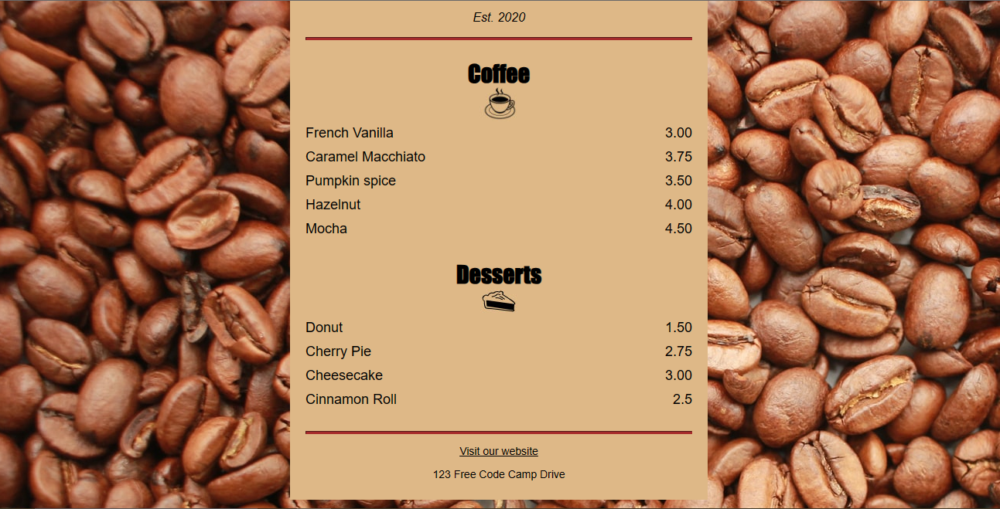

# cafe-menu
 A cafe menu built with html and CSS
 
## Overview

## screenshot

## My process

This project was built by basic html and css properties.

# Frontend Mentor - QR code component solution

This is a solution to the [QR code component challenge on Frontend Mentor](https://www.frontendmentor.io/challenges/qr-code-component-iux_sIO_H). Frontend Mentor challenges help you improve your coding skills by building realistic projects. 

## Table of contents

- [Overview](#overview)
  - [Screenshot](#screenshot)
- [My process](#my-process)
  - [Built with](#built-with)
  - [What I learned](#what-i-learned)
  - [Continued development](#continued-development)
  - [Useful resources](#useful-resources)
- [Author](#author)

**Note: Delete this note and update the table of contents based on what sections you keep.**

## Overview

### Screenshot

## My process

### Built with

- HTML
- CSS 

### What I've learned

I've learned a new way of organizing code to enhance flow and understanding as you write code. 
One way that has really stood out is the targeting of the type and class selectors in CSS before creating them in HTML.  

### Continued development

I still need more practice on padding and margin properties while formatting div elements. 

### Useful resources

- [MDN Docs](https://developer.mozilla.org/) came in handy when I'd forgotten some elements in coding. 
- [Dr Angela Yu's Course](https://www.udemy.com/share/101qYw3@L4fp6FHQmfBr0zjbW1itoREIN9o6QYb6Ls7Mg6qwfXJxqYdP3wiPAbz_ClZh2CDquA==/) has been an amazing foundational resource that has helped me understand what I code. 
- [The Free code camp](https://www.freecodecamp.org/) has been the best resource for thousands of practice projects. This very Cafe Menu being one of them! I'd highly recommend it for every beginner developer. It provides a well-structured and beginner-friendly, easy roadmap for coding.  

## Author

- Github - [Rita Ogada](https://github.com/ritaogada)
- Frontend Mentor - [@ritaogada](https://www.frontendmentor.io/profile/ritaogada)
- Twitter - [@RitaOgada](https://twitter.com/RitaOgada)
